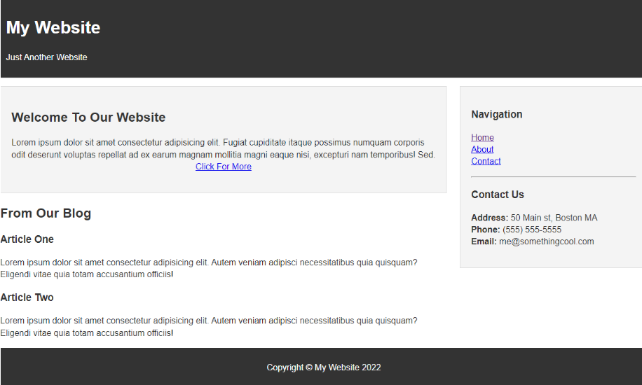
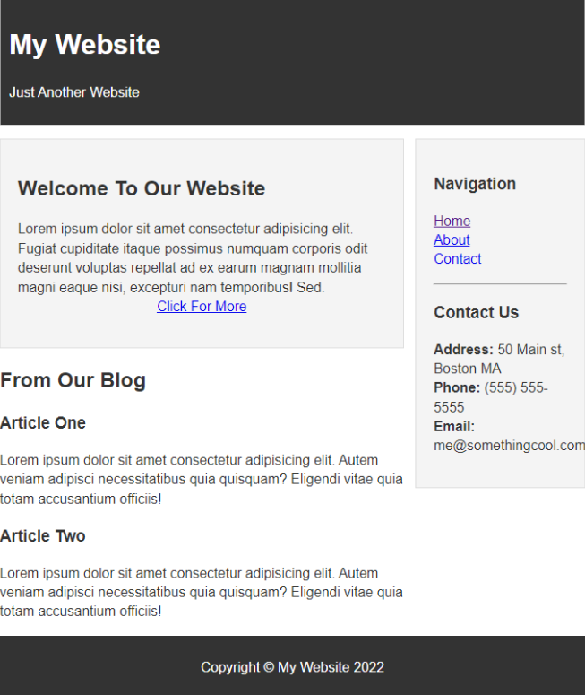

420-931-VA - Front End Web Programming Winter 2025 

# Front-End Web Programming - Final Exam

This template repository is the starter project for Front-end Programming Final Exam. Written in HTML5/CSS3/Bootstrap/JavaScript/JQuery.

### Question(s)

1. Create the following page using HTML5, CSS, Javascript, and/or Bootstrap. The page should be responsive and have all the details shown in the following screenshots.

In addition, add a button under the “Contact Us” section. When you click on it, it should dynamically modify the page's HTML and/or CSS using Javascript (the modification is up to you).

When you click on the “Click for More” button, the page should navigate to a blog page (Any blog page on the web is fine).

When you click on the “About” button, the page should navigate to the following page:

https://www.vaniercollege.qc.ca/about-vanier-college/

When you click on the “Contact” button, the page should navigate to the following page:

https://www.vaniercollege.qc.ca/contact-vanier/

**Grading Scheme (Out of 30 points)**

- Proper use of HTML (10 points)
- Proper and adequate use of CSS (10 points)
- Proper and adequate use of Javascript (10 points)

